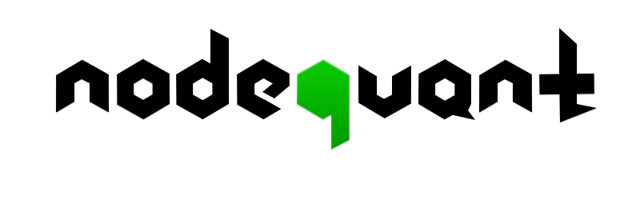
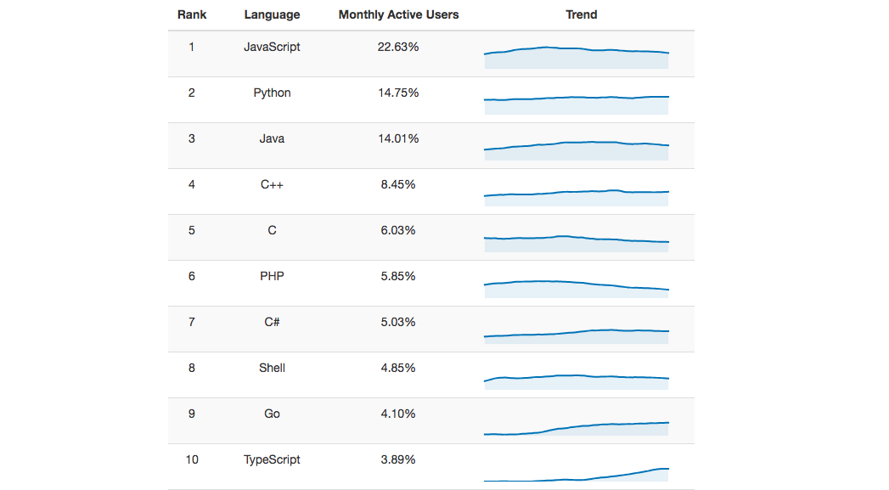

# NodeQuant

## NodeQuant的愿景

让Node.js社区轻巧地开发和部署量化金融交易程序，成为一个简单、高效、可依赖的量化交易平台

## NodeQuant简介

国内的量化交易平台大多是C、C++、C\#、Java、Python等语言编写量化策略。从事量化交易的人员在学会金融数据的分析的同时也要学好一门编程语言，往往学好一门编程语言对于很多人是一个不小的门槛。JavaScript语言是一门简单轻便的脚本语言，学习和编写JavaScript程序都非常简单。脚本语言具有弱类型的特点，不需要开发者在编写程序的过程中适配各种数据类型，入门快速。  
JavaScript有大量的开发者，它是GitHub上最热门的编程语言。JavaScript语言借助Node.js运行环境,可以使得JavaScript也可以像C++、C\#等高级语言一样运行在服务器端，可以进行读写文件，数据库，访问网络等操作。

### Github 10大最受欢迎语言

Node.js 是一个基于 Chrome V8 引擎的 JavaScript 运行环境。

Node.js 使用了一个事件驱动、非阻塞式 I/O 的模型，使其轻量又高效。

Node.js 的包管理器 npm，是全球最大的开源库生态系统。使用npm可以找到各种各样的第三方库，开发者可以集成到自己的程序当中。

量化金融交易程序是一种是基于高频网络访问和各种事件（OnTick,OnOrder,OnTrade）的数据密集型程序。由于Node.js非阻塞的，事件驱动的 I/O 操作等特点，使得它处理数据密集型实时应用时非常轻巧高效，可以认为是数据密集型分布式部署环境下的实时应用系统的完美解决方案。

使用Node.js来编写和运行量化交易策略程序是一个非常好的解决方案。

这就是NodeQuant量化金融交易平台诞生的背景。

## NodeQuant开发文档

[https://github.com/zhangshuiyong/nodequant/blob/master/SUMMARY.md](https://github.com/zhangshuiyong/nodequant/blob/master/SUMMARY.md)

